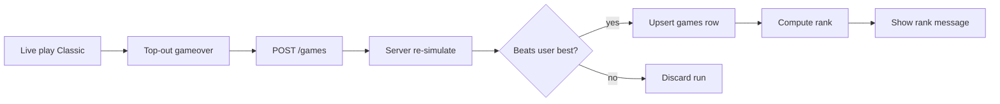

# Classic mode (level + time ranking)

**Status: implemented.** This document is the design spec and implementation record.

## What Classic mode is

- A **Classic** solo mode (`/?mode=classic`) where gravity ramps up as the player **clears lines** (NES-style gravity table → levels).
- The run ends on **top-out (gameover)** — there is no “win” line/time goal.
- **Score** at death: **level reached** + **survival time**.
- **Leaderboard ranking** (higher is better):
  1. Level (desc)
  2. Survival time (desc) — e.g. `12 / 1h 20m 12s` beats `10 / 30m 45s`
- **One stored run per user** for Classic (DB-enforced + application upsert).
- **Live level display** in the sidebar during play.
- **Finish feedback**:
  - **Logged-in** new personal best → rank message + optional replay link.
  - **Guest** new session best → same rank message (hypothetical) + Sign up / Log in CTA.

## Level progression (current behavior)

Levels advance by **lines cleared**, not elapsed time.

- **`linesPerLevel: 10`** in the classic speed profile.
- **Level formula:** `floor(linesCleared / linesPerLevel) + 1` (level 1 from the start).
- Examples: 0–9 lines → level 1; 10–19 → level 2; 120–129 → level 13.
- **Gravity** uses the classic table indexed by current level (caps at level 24 entries; level number can exceed 24).

```ts
// app/game/modes.ts
classic: {
  id: 'classic',
  label: 'Classic',
  goal: { type: 'survival' },
  speed: { linesPerLevel: 10, gravityTicks: CLASSIC_GRAVITY_TICKS },
}
```

```ts
// app/game/engine.ts
export function levelForLines(mode: GameMode, linesCleared: number): number
export function levelFor(state: GameState): number  // uses state.linesCleared
```

> **Design change (Jul 2026):** Early drafts used `levelEverySeconds: 10` (timer-driven levels). This was replaced with line-driven progression so speed increases only when the player clears lines.

## Architecture



### Key modules

| Area | File | Role |
|------|------|------|
| Modes | [`app/game/modes.ts`](../app/game/modes.ts) | `classic` entry, `isSurvivalMode`, `rankingKind` |
| Engine | [`app/game/engine.ts`](../app/game/engine.ts) | `levelFor`, `gravityTicksFor`, `simulate`, `SURVIVAL_MAX_TICKS` |
| Submit | [`app/actions/games/controller.tsx`](../app/actions/games/controller.tsx) | Classic gameover acceptance, rank responses |
| Storage | [`app/data/games.ts`](../app/data/games.ts) | `beatsClassicScore`, upsert, leaderboard sort |
| Pending | [`app/utils/pending-game.ts`](../app/utils/pending-game.ts) | Guest session best, `claimPendingGame` |
| Live UI | [`app/assets/game-view.tsx`](../app/assets/game-view.tsx) | Level panel |
| Finish UI | [`app/assets/game-board.tsx`](../app/assets/game-board.tsx) | `ClassicFinishOverlay`, submit on gameover |
| Replay | [`app/actions/games/replay-page.tsx`](../app/actions/games/replay-page.tsx) | `formatClassicScore` header for classic |
| Leaderboard | [`app/ui/leaderboard-page.tsx`](../app/ui/leaderboard-page.tsx) | Level / Time column |
| Format | [`app/utils/format.ts`](../app/utils/format.ts) | `formatClassicScore`, `formatDurationLong` |

### Engine details

- **`gravityTicksFor(state)`** — looks up `mode.speed.gravityTicks[level - 1]` (clamped to table length).
- **`simulate()`** — for survival modes, a valid finish is `status === 'gameover'`; returns `level` from `levelFor(state)` after replay.
- **`SURVIVAL_MAX_TICKS`** — two-hour cap (`60 * 60 * 120` ticks) for long classic replays; `maxTicksForMode()` uses this for classic vs sprint’s 10-minute default.

### Schema & migrations

1. **`20260707000001_add_games_level`** — `games.level INTEGER NOT NULL DEFAULT 0` (sprint rows stay 0).
2. **`20260707000002_classic_user_unique`** — dedupe existing classic rows; partial unique index `games_classic_user_idx ON games(user_id) WHERE mode = 'classic'`.

### Best-only storage + rank

**Score comparison:**

```ts
function beatsClassicScore(candidate, existing): boolean {
  if (candidate.level !== existing.level) return candidate.level > existing.level
  return candidate.duration_ms > existing.duration_ms
}
```

**Policies:**

- Logged-in: upsert only when `beatsClassicScore`; worse runs discarded.
- Guest: same comparison against session `pendingGame`; hypothetical rank from public leaderboard.
- `claimPendingGame`: on login, upsert classic best; if pending run is worse, redirect to existing best replay.

**Submit response shapes** (unchanged from original plan — see prior examples in git history).

### UI

**Live play** — left sidebar for classic:

```
[Hold]     [Board]     [Next / Queue]
[Time]
[Level]    ← from levelFor(state), updates when lines cleared
```

**Finish overlay (new best):**

```
You have achieved your best time, your rank now is #3!
12 / 1h 20m 12s
[View replay]  [Try again]
```

**Guest new session best** adds Sign up / Log in above Try again. No auto-redirect to replay on classic (unlike sprint).

**Home page** — title shows `{label}` for classic, `{label} Sprint` only for line modes.

## Testing

Covered in `test/engine.test.ts`, `test/app.test.ts`, `test/gameover-replay.ts`:

- Level rises every 10 lines cleared; gravity accelerates at higher levels.
- `simulate()` returns gameover + correct level for classic.
- Classic simulate cap > sprint cap; capped at two hours.
- HTTP: guest classic submit with rank; logged-in best-only upsert.
- Leaderboard renders `Level / Time`.

Run: `npm test`

## Files changed (implementation)

- [`app/game/modes.ts`](../app/game/modes.ts)
- [`app/game/engine.ts`](../app/game/engine.ts)
- [`app/data/schema.ts`](../app/data/schema.ts)
- [`app/data/games.ts`](../app/data/games.ts)
- [`app/actions/games/controller.tsx`](../app/actions/games/controller.tsx)
- [`app/actions/games/replay-page.tsx`](../app/actions/games/replay-page.tsx)
- [`app/utils/pending-game.ts`](../app/utils/pending-game.ts)
- [`app/utils/format.ts`](../app/utils/format.ts)
- [`app/ui/leaderboard-page.tsx`](../app/ui/leaderboard-page.tsx)
- [`app/assets/game-board.tsx`](../app/assets/game-board.tsx)
- [`app/assets/game-view.tsx`](../app/assets/game-view.tsx)
- [`app/ui/home-page.tsx`](../app/ui/home-page.tsx)
- `db/migrations/20260707000001_add_games_level/`
- `db/migrations/20260707000002_classic_user_unique/`
- `test/engine.test.ts`, `test/app.test.ts`, `test/gameover-replay.ts`
