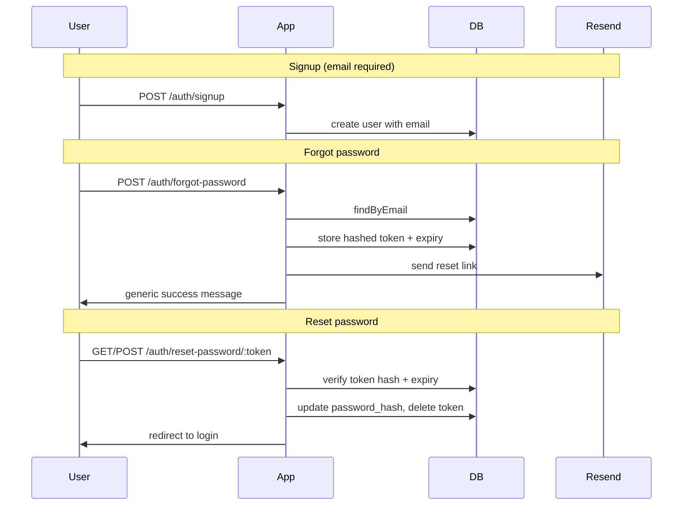

# Email on profile + password recovery via Resend

**Status: implemented.** This document is the design spec and implementation record.

## What this adds

- **Required email at signup** — every new account must provide a valid, unique email.
- **Email on profile** — the signed-in user's profile page shows their email under their username (read-only in v1).
- **Forgot password** — user enters email; if an account exists, a reset link is sent via Resend from `noreply@retris.world`.
- **Reset password** — single-use token link sets a new password and redirects to login.

Login continues to use **username + password** (not email).

## Architecture



### Key modules (planned)

| Area | File | Role |
|------|------|------|
| Schema | [`app/data/schema.ts`](../app/data/schema.ts) | `users.email`, `password_reset_tokens` table |
| Users | [`app/data/users.ts`](../app/data/users.ts) | `findByEmail`, `createUser` with email, `updatePassword` |
| Reset tokens | `app/data/password-reset.ts` | `createResetToken`, `consumeResetToken`, `deleteTokensForUser` |
| Mail | [`app/mail/`](../app/mail/) | `MailSender` port; Resend / memory / noop adapters; templates |
| Signup | [`app/actions/auth/signup/controller.tsx`](../app/actions/auth/signup/controller.tsx) | Require and validate email |
| Forgot | `app/actions/auth/forgot-password/controller.tsx` | Request reset link |
| Reset | `app/actions/auth/reset-password/controller.tsx` | Set new password from token |
| Profile | [`app/ui/profile-page.tsx`](../app/ui/profile-page.tsx) | Display email |
| Admin | [`app/ui/admin-page.tsx`](../app/ui/admin-page.tsx) | Email column in users table |

## Schema & migrations

### `20260707000003_add_user_email`

```sql
alter table users add column email text;
create unique index users_email_idx on users (email);
```

- Column is **nullable at the DB level** so existing rows (dev DB, tests) migrate cleanly.
- **Application layer** enforces email as required on signup. Users without an email cannot use password recovery until one is set.

### `20260707000004_create_password_reset_tokens`

```sql
create table password_reset_tokens (
  id integer primary key autoincrement,
  user_id integer not null references users(id) on delete cascade,
  token_hash text not null unique,
  expires_at integer not null,
  created_at integer not null
);
create index password_reset_tokens_user_id_idx on password_reset_tokens (user_id);
```

## Data layer

Extend [`app/data/users.ts`](../app/data/users.ts):

| Function | Purpose |
|----------|---------|
| `findByEmail(db, email)` | Lookup for password reset |
| `createUser(db, username, email, password)` | Signup with email uniqueness |
| `updatePassword(db, userId, password)` | Apply new hash after reset |

New `app/data/password-reset.ts`:

| Function | Purpose |
|----------|---------|
| `createResetToken(db, userId)` | Generate random token, store **hash** (`crypto.createHash('sha256')` or scrypt), return raw token for email link |
| `consumeResetToken(db, rawToken)` | Verify hash + `expires_at > now`, return `userId`, delete row (single-use) |
| `deleteTokensForUser(db, userId)` | Cleanup before issuing a new token |

Token TTL: **1 hour**. Invalidate previous tokens for the same user when issuing a new one.

## Mail module (provider-agnostic)

Outbound mail lives under [`app/mail/`](../app/mail/), decoupled from auth controllers and from any single vendor.

```
app/mail/
  types.ts           MailMessage + MailSender interface
  templates.ts       passwordResetEmail() — HTML + subject only
  create-sender.ts   picks implementation from env
  senders/
    resend.ts        Resend HTTP API
    memory.ts        captures messages in tests
    noop.ts          logs when unconfigured (local dev)
  index.ts           sendMail(), sendPasswordResetEmail(), test hooks
```

Controllers call [`sendPasswordResetEmail(to, token)`](../app/mail/index.ts) — they never import Resend directly.

**Env (production):**

```env
RESEND_API_KEY=re_xxxxxxxx
MAIL_FROM=noreply@retris.world
APP_URL=https://retris.world
```

Verify `retris.world` in the Resend dashboard and add their DNS records in Namecheap. When `RESEND_API_KEY` is unset, forgot-password still succeeds in the UI but mail is not sent (noop + console warning).

To add another provider later: implement `MailSender` in `app/mail/senders/` and register it in `create-sender.ts`.

## Routes and controllers

Extend [`app/routes.ts`](../app/routes.ts):

```typescript
auth: route('auth', {
  login: form('login'),
  signup: form('signup'),
  logout: post('logout'),
  forgotPassword: form('forgot-password'),
  resetPassword: form('reset-password/:token'),
}),
```

Wire in [`app/router.ts`](../app/router.ts) with new controllers under `app/actions/auth/`.

### Forgot password

`app/actions/auth/forgot-password/controller.tsx` + `app/ui/forgot-password-page.tsx`:

- GET: form with email field.
- POST: validate email format (`remix/data-schema/checks` `email()`), look up user.
- **Always** render the same success message ("If an account exists, we sent a reset link") to avoid user enumeration.
- If user found: create token, send email.
- Link from login form: "Forgot password?"

### Reset password

`app/actions/auth/reset-password/controller.tsx` + `app/ui/reset-password-page.tsx`:

- GET: validate token exists and is not expired; show new-password form (or error page if invalid).
- POST: `consumeResetToken`, `updatePassword`, redirect to login with flash/success message.
- Password rules: same as signup (min 6 chars).

## Signup changes

[`app/ui/auth-form.tsx`](../app/ui/auth-form.tsx): add email input on signup only (`type="email"`, `autoComplete="email"`).

[`app/actions/auth/signup/controller.tsx`](../app/actions/auth/signup/controller.tsx):

- Add `email: f.field(s.string().pipe(email()))` to schema.
- Pass email to `createUser`.
- Handle duplicate email like duplicate username ("That email is already in use.").

## Profile: show email

[`app/ui/layout.tsx`](../app/ui/layout.tsx): extend `ShellUser` with `email?: string`.

[`app/actions/controller.tsx`](../app/actions/controller.tsx) profile action: pass `email` from `auth.identity`.

[`app/ui/profile-page.tsx`](../app/ui/profile-page.tsx): display email under the username heading (muted text). No edit form in v1 — signup is the source of truth.

Admin table ([`app/ui/admin-page.tsx`](../app/ui/admin-page.tsx)): add an Email column.

## Security

- Store only **hashed** reset tokens; raw token appears only in the email URL.
- Single-use tokens; delete on consume.
- Generic forgot-password response regardless of whether email exists.
- After reset, redirect to login (user re-authenticates). Full session invalidation across all devices is not practical with filesystem session storage; acceptable for v1.
- `robots.txt` already disallows `/auth/` — no change needed.

## Testing

In [`test/app.test.ts`](../test/app.test.ts):

- Signup requires and persists email.
- Reject duplicate email.
- Forgot password returns 200 with generic message (with and without matching user).
- Reset password with valid token updates password and allows login with new password.
- Expired/invalid token returns error.

Use `sentMails` / `clearSentMails()` from [`app/mail/index.ts`](../app/mail/index.ts) to capture reset links in tests.

Run: `npm test`

## Files touched (summary)

| Area | Files |
|------|-------|
| Schema | `db/migrations/20260707000003_*`, `db/migrations/20260707000004_*`, [`app/data/schema.ts`](../app/data/schema.ts) |
| Data | [`app/data/users.ts`](../app/data/users.ts), `app/data/password-reset.ts` |
| Mail | [`app/mail/`](../app/mail/) |
| Routes | [`app/routes.ts`](../app/routes.ts), [`app/router.ts`](../app/router.ts) |
| Auth UI | [`app/ui/auth-form.tsx`](../app/ui/auth-form.tsx), `app/ui/forgot-password-page.tsx`, `app/ui/reset-password-page.tsx` |
| Auth actions | [`app/actions/auth/signup/controller.tsx`](../app/actions/auth/signup/controller.tsx), forgot/reset controllers |
| Profile | [`app/ui/profile-page.tsx`](../app/ui/profile-page.tsx), [`app/actions/controller.tsx`](../app/actions/controller.tsx) |
| Config | [`.env.example`](../.env.example), [`types.d.ts`](../types.d.ts) |
| Tests | [`test/app.test.ts`](../test/app.test.ts) |

## Out of scope (can add later)

- Email verification / confirmed-at column
- Logged-in "change password" or "change email" settings page
- Rate limiting on forgot-password endpoint
- Migrating existing users who have no email (they can still log in with username; recovery unavailable until email is added manually or via a future settings flow)
